<div align="center">

<h2>⚒️ Revisiting Adversarial Patch Defenses on Object Detectors: Unified Evaluation, Large-Scale Dataset, and New Insights</h2>

[](https://opensource.org/licenses/MIT)
[](https://www.python.org/)
[](https://pytorch.org/)


[**English**](./README.md) | [**中文**](./README_zh.md)

</div>

> **Note**: This project focuses on the research of adversarial patch attacks and defenses for Object Detectors, providing a complete pipeline for attacks, defenses, and evaluation.
> 
> This is the official repository for the paper [Revisiting Adversarial Patch Defenses on Object Detectors: Unified Evaluation, Large-Scale Dataset, and New Insights](https://arxiv.org/abs/2508.00649) accepted by ICCV2025.

## 📅 Roadmap & To-Do List

The current development plan is as follows, and we will continue to update this list:

- [ ] **1. Detector Evaluation Framework**
    - [ ] Integrate mainstream detector interfaces (YOLOv2/3/4/5/7, Faster R-CNN, SSD, CenterNet, ...).
    - [ ] Provide standardized robustness evaluation metrics (mAP under Attack, Attack Success Rate).

- [x] **2. APDE Dataset**
    - [x] Release the **A**dversarial **P**atch **D**efense **E**valuation dataset download link.
    - [x] Provide dataset readers, integrity checks, and Hugging Face download/processing examples.

- [x] **3. Retrained Defense**
    - [x] Release retrained defense weights (SAC, Adyolo, NAPGuard).
    - [x] Provide Model Zoo table comparing Adv mAP before and after retraining.

- [ ] **4. Continuous Updates**
    - [ ] **Attack Codes**: Integrate the latest attack algorithms (T-SEA, ...).
    - [ ] **Patches**: Update adversarial patches to provide references for new defense works.

---

## 🚀 Introduction

With the application of deep learning in autonomous driving and security surveillance, the safety of object detectors has attracted significant attention. This repository aims to provide a unified platform for:
1. Generating high-quality adversarial samples (Adversarial Patch Attacks).
2. Evaluating the vulnerability of existing detectors when facing attacks.
3. Improving model defense capabilities through the APDE dataset and adversarial training.

## 🛠️ Installation

```bash
# Clone the repository
git clone https://github.com/Gandolfczjh/APDE.git
cd APDE

# Create a virtual environment
conda create -n APDE python=3.10
conda activate APDE

# Install dependencies
pip install -r requirements.txt
```

## APDE dataset

The reconstructed dataset is complete and validated: **94 patch types, 94,000 patched images**, with one mask and annotation file per image. The full dataset is available on **[Hugging Face](https://huggingface.co/datasets/Gandolfczjh/APDE)**. This Git repository includes the patch originals and reader tools. Follow the [download and usage examples](#download-and-use-apde-from-hugging-face) below; see the [dataset card](docs/HF_DATASET_CARD.md) for formats, sources, and evaluation details.

| Split | Patch types | Patched images |
|---|---:|---:|
| Train | 57 | 57,000 |
| Test | 37 | 37,000 |
| Total | 94 | 94,000 |

This is a reconstruction, **not the exact original dataset used for the paper**. The paper reports 56,400/37,600 images; this release keeps each 1,000-image patch type entirely in one split. Clean sources are shared across patch types, including across train/test. Split isolation applies to patch types, not source photographs.

The source pool contains 1,000 positives (81 INRIA Test + 919 COCO val2017) sampled without replacement from 288 + 2,693 positive candidates, and 1,000 annotation-negative backgrounds (162 INRIA + 838 COCO). Images are padded/resized to 416×416. Masks are lossless binary PNG (0/255); annotation rows are `person x1 y1 x2 y2` and `patch x1 y1 x2 y2` in pixel coordinates. Patch right/bottom coordinates are exclusive.

### Download and use APDE from Hugging Face

**Dataset: [Gandolfczjh/APDE](https://huggingface.co/datasets/Gandolfczjh/APDE)**

Install the data dependencies from this repository:

```bash
python -m pip install -r requirements-data.txt
```

| Configuration | Splits | Contents |
|---|---|---|
| `patched` (default) | `train`: 57,000; `test`: 37,000 | Patched images, binary masks, TXT annotations and metadata |
| `clean` | `positive`: 1,000; `negative`: 1,000 | Clean source images and person boxes |
| `patches` | `all`: 94 | Original patches and train/test assignments |

#### Load online

```python
from datasets import load_dataset

data = load_dataset("Gandolfczjh/APDE", "patched")
assert len(data["train"]) == 57000
assert len(data["test"]) == 37000
sample = data["test"][0]

clean = load_dataset("Gandolfczjh/APDE", "clean")
patches = load_dataset("Gandolfczjh/APDE", "patches", split="all")
```

The first call downloads and prepares the selected configuration in the Hugging Face cache; subsequent calls reuse it. For a quick preview without downloading the entire configuration first, use streaming:

```python
stream = load_dataset("Gandolfczjh/APDE", "patched", split="test", streaming=True)
sample = next(iter(stream))
```

#### Download all files and load locally

The complete release contains 97 Parquet files and is about 20 GB. Allow extra disk space for the prepared cache or extracted images. Run from the cloned code repository; `APDE` below is a data subdirectory:

```bash
hf download Gandolfczjh/APDE --repo-type dataset --local-dir APDE
python tools/verify_apde_hf.py APDE
```

Repeat the download command to resume an interrupted download. Once downloaded, load the local Parquet files:

```python
from datasets import load_dataset

data = load_dataset("parquet", data_files={
    "train": "APDE/data/train/*.parquet",
    "test": "APDE/data/test/*.parquet",
})
sample = data["test"][0]
```

The HF release embeds image, mask and annotation contents in Parquet. Its `data/train`, `data/test`, `clean` and `patches` folders differ from the original PNG/JSONL layout below. Use `load_dataset()` for downloaded HF files; `APDEDataset("APDE")` expects the original layout with `train.jsonl` and `test.jsonl`.

#### Process images, masks and annotations

```python
from pathlib import Path
import numpy as np
from apde_data.dataset import parse_labels

image = sample["image"].convert("RGB")  # PIL image, 416 x 416
mask = sample["mask"].convert("L")      # 0 = background, 255 = patch
boxes = parse_labels(sample["labels"])
person_boxes = boxes["person_boxes"]   # pixel-coordinate [x1, y1, x2, y2]
patch_boxes = boxes["patch_boxes"]

image_array = np.asarray(image, dtype=np.float32) / 255.0  # H x W x 3
mask_array = (np.asarray(mask) > 0).astype(np.uint8)        # H x W, values 0/1

# Export one sample to ordinary PNG/TXT files.
image.save("sample.png")
mask.save("sample_mask.png")
Path("sample.txt").write_text(sample["labels"], encoding="utf-8")
```

Each row also includes `id`, `source_id`, `patch_id`, `method`, `detector`, `attack_goal` and `split`. For clean-source rows, parse `person_boxes_json` with `json.loads()`. Apply geometric transforms consistently to images, masks and boxes, and use nearest-neighbor interpolation for masks. Preserve the supplied patch-type split when training and evaluating.

See the official HF [loading guide](https://huggingface.co/docs/datasets/loading) and [download guide](https://huggingface.co/docs/huggingface_hub/guides/download).

### Directory layout

```text
APDE/
├── clean/
│   ├── positive/{images,labels}/        # 1,000 clean positive samples
│   └── negative/{images,labels}/        # 1,000 clean negative samples
├── groups/<method>/<detector>/
│   ├── images/                         # 1,000 RGB PNGs per patch type
│   ├── masks/                          # 1,000 binary PNG masks
│   ├── labels/                         # 1,000 TXT annotations
│   ├── patch.png                       # Frozen patch used for this group
│   ├── samples.jsonl                   # Paths, split, and hashes
│   └── complete.json
├── images/<method>/<detector>/          # Compatibility symlink to groups
├── annotations/<method>/
│   ├── <detector>_label/                # Compatibility symlink
│   └── <detector>_mask/                 # Compatibility symlink
├── train.jsonl                         # 57,000 sample records
├── test.jsonl                          # 37,000 sample records
├── split_plan.json
├── positive_sources.json
├── negative_sources.json
├── source_report.json
├── build_report.json
├── audit_report.json
├── pipeline_status.json
├── code_snapshot/
└── preview.jpg
```

The eight matrix families (`advpatch`, `TCEGA`, `tsea-pgd`, `tsea-mim`, `TCA`, `tsea`, `GNAP`, `DM-NAP`) each cover 11 detectors: `yolov2`, `yolov3`, `yolov4`, `yolov5`, `yolov7`, `ssd`, `centernet`, `retinanet`, `mask_rcnn`, `faster_rcnn`, `ddetr`.

The remaining six types are **test-only**: `AdvCloak/yolov2`, `AdvCloak/yolov3`, `AdvTshirt/yolov2`, `AA/yolov2`, `AdvSticker/yolov3`, and `UPC/yolov3`. The train/test JSONL manifests define the split; there are no duplicated train/test image directories.

<!-- APDE patch gallery -->

### Gallery of all 94 patches

All previews use a height of 96 pixels and preserve their original aspect ratios. Click a patch to view the original. Each caption identifies the detector and train/test assignment.

#### AdvPatch

<table>
  <tr>
    <td align="center" width="120"><a href="assets/patches/advpatch/yolov2.png">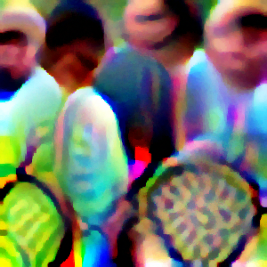</a><br><sub>YOLOv2<br>Test</sub></td>
    <td align="center" width="120"><a href="assets/patches/advpatch/yolov3.png">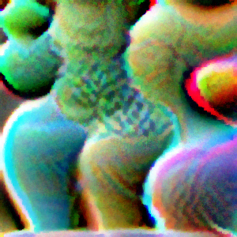</a><br><sub>YOLOv3<br>Test</sub></td>
    <td align="center" width="120"><a href="assets/patches/advpatch/yolov4.png"></a><br><sub>YOLOv4<br>Train</sub></td>
    <td align="center" width="120"><a href="assets/patches/advpatch/yolov5.png">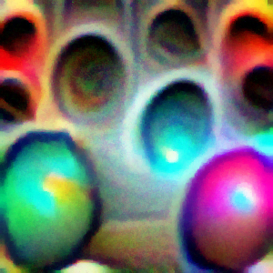</a><br><sub>YOLOv5<br>Train</sub></td>
    <td align="center" width="120"><a href="assets/patches/advpatch/yolov7.png">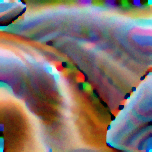</a><br><sub>YOLOv7<br>Train</sub></td>
    <td align="center" width="120"><a href="assets/patches/advpatch/ssd.png">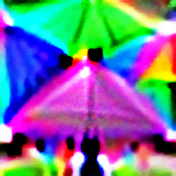</a><br><sub>SSD<br>Train</sub></td>
  </tr>
  <tr>
    <td align="center" width="120"><a href="assets/patches/advpatch/centernet.png">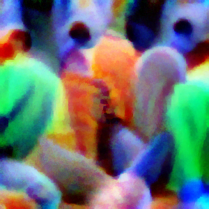</a><br><sub>CenterNet<br>Train</sub></td>
    <td align="center" width="120"><a href="assets/patches/advpatch/retinanet.png">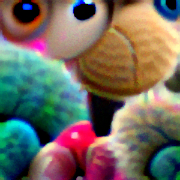</a><br><sub>RetinaNet<br>Train</sub></td>
    <td align="center" width="120"><a href="assets/patches/advpatch/mask_rcnn.png">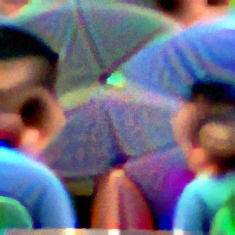</a><br><sub>Mask R-CNN<br>Test</sub></td>
    <td align="center" width="120"><a href="assets/patches/advpatch/faster_rcnn.png">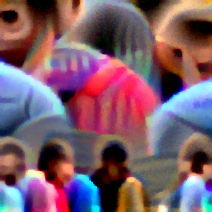</a><br><sub>Faster R-CNN<br>Train</sub></td>
    <td align="center" width="120"><a href="assets/patches/advpatch/ddetr.png">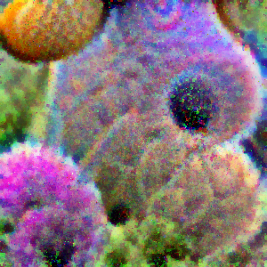</a><br><sub>D-DETR<br>Test</sub></td>
  </tr>
</table>

#### TC-EGA

<table>
  <tr>
    <td align="center" width="120"><a href="assets/patches/TCEGA/yolov2.png">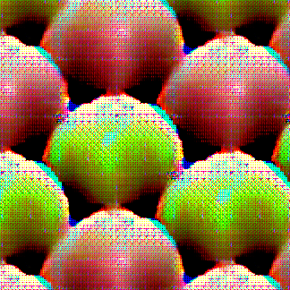</a><br><sub>YOLOv2<br>Train</sub></td>
    <td align="center" width="120"><a href="assets/patches/TCEGA/yolov3.png">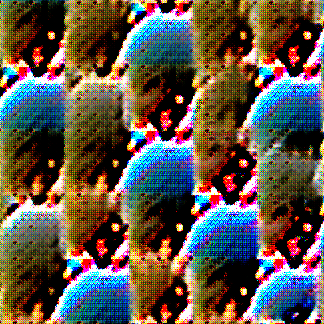</a><br><sub>YOLOv3<br>Train</sub></td>
    <td align="center" width="120"><a href="assets/patches/TCEGA/yolov4.png">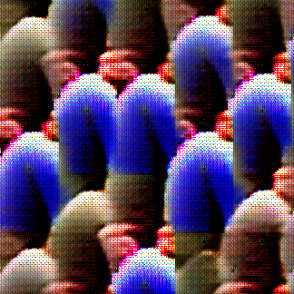</a><br><sub>YOLOv4<br>Train</sub></td>
    <td align="center" width="120"><a href="assets/patches/TCEGA/yolov5.png">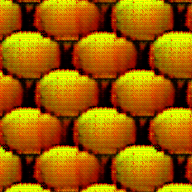</a><br><sub>YOLOv5<br>Train</sub></td>
    <td align="center" width="120"><a href="assets/patches/TCEGA/yolov7.png">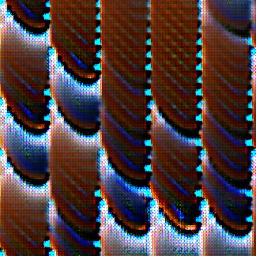</a><br><sub>YOLOv7<br>Test</sub></td>
    <td align="center" width="120"><a href="assets/patches/TCEGA/ssd.png">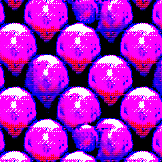</a><br><sub>SSD<br>Train</sub></td>
  </tr>
  <tr>
    <td align="center" width="120"><a href="assets/patches/TCEGA/centernet.png">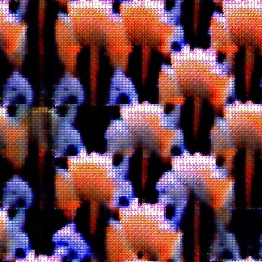</a><br><sub>CenterNet<br>Test</sub></td>
    <td align="center" width="120"><a href="assets/patches/TCEGA/retinanet.png">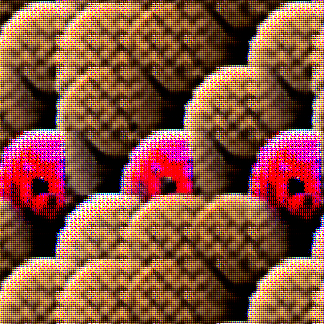</a><br><sub>RetinaNet<br>Test</sub></td>
    <td align="center" width="120"><a href="assets/patches/TCEGA/mask_rcnn.png">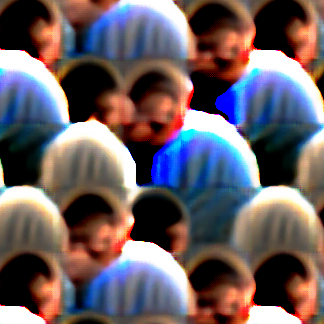</a><br><sub>Mask R-CNN<br>Train</sub></td>
    <td align="center" width="120"><a href="assets/patches/TCEGA/faster_rcnn.png">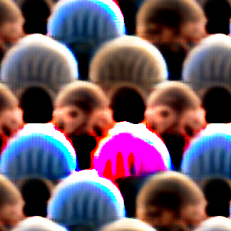</a><br><sub>Faster R-CNN<br>Train</sub></td>
    <td align="center" width="120"><a href="assets/patches/TCEGA/ddetr.png">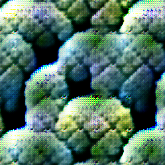</a><br><sub>D-DETR<br>Test</sub></td>
  </tr>
</table>

#### T-SEA-PGD

<table>
  <tr>
    <td align="center" width="120"><a href="assets/patches/tsea-pgd/yolov2.png">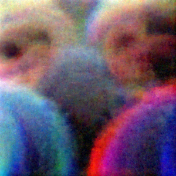</a><br><sub>YOLOv2<br>Train</sub></td>
    <td align="center" width="120"><a href="assets/patches/tsea-pgd/yolov3.png">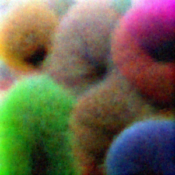</a><br><sub>YOLOv3<br>Train</sub></td>
    <td align="center" width="120"><a href="assets/patches/tsea-pgd/yolov4.png">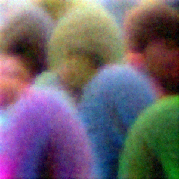</a><br><sub>YOLOv4<br>Train</sub></td>
    <td align="center" width="120"><a href="assets/patches/tsea-pgd/yolov5.png">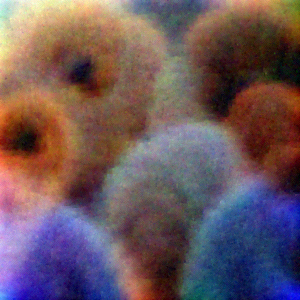</a><br><sub>YOLOv5<br>Test</sub></td>
    <td align="center" width="120"><a href="assets/patches/tsea-pgd/yolov7.png">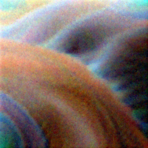</a><br><sub>YOLOv7<br>Test</sub></td>
    <td align="center" width="120"><a href="assets/patches/tsea-pgd/ssd.png">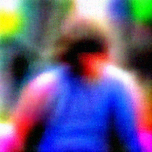</a><br><sub>SSD<br>Train</sub></td>
  </tr>
  <tr>
    <td align="center" width="120"><a href="assets/patches/tsea-pgd/centernet.png">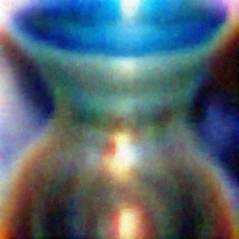</a><br><sub>CenterNet<br>Test</sub></td>
    <td align="center" width="120"><a href="assets/patches/tsea-pgd/retinanet.png">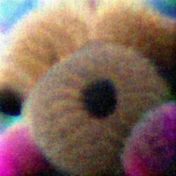</a><br><sub>RetinaNet<br>Train</sub></td>
    <td align="center" width="120"><a href="assets/patches/tsea-pgd/mask_rcnn.png">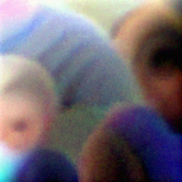</a><br><sub>Mask R-CNN<br>Train</sub></td>
    <td align="center" width="120"><a href="assets/patches/tsea-pgd/faster_rcnn.png">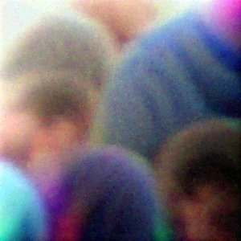</a><br><sub>Faster R-CNN<br>Train</sub></td>
    <td align="center" width="120"><a href="assets/patches/tsea-pgd/ddetr.png">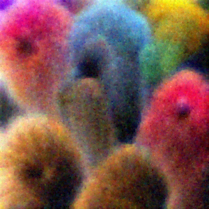</a><br><sub>D-DETR<br>Train</sub></td>
  </tr>
</table>

#### T-SEA-MIM

<table>
  <tr>
    <td align="center" width="120"><a href="assets/patches/tsea-mim/yolov2.png">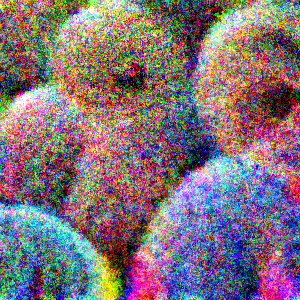</a><br><sub>YOLOv2<br>Train</sub></td>
    <td align="center" width="120"><a href="assets/patches/tsea-mim/yolov3.png">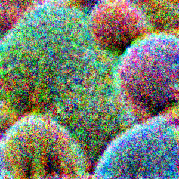</a><br><sub>YOLOv3<br>Train</sub></td>
    <td align="center" width="120"><a href="assets/patches/tsea-mim/yolov4.png">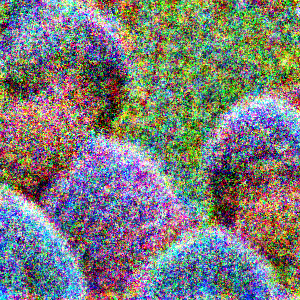</a><br><sub>YOLOv4<br>Test</sub></td>
    <td align="center" width="120"><a href="assets/patches/tsea-mim/yolov5.png">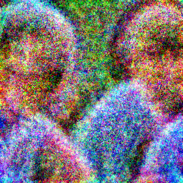</a><br><sub>YOLOv5<br>Test</sub></td>
    <td align="center" width="120"><a href="assets/patches/tsea-mim/yolov7.png">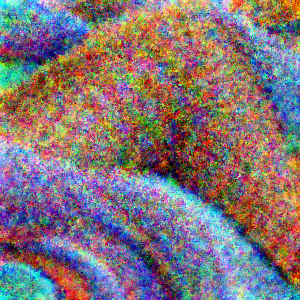</a><br><sub>YOLOv7<br>Train</sub></td>
    <td align="center" width="120"><a href="assets/patches/tsea-mim/ssd.png">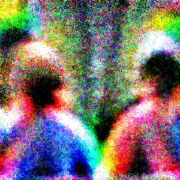</a><br><sub>SSD<br>Train</sub></td>
  </tr>
  <tr>
    <td align="center" width="120"><a href="assets/patches/tsea-mim/centernet.png">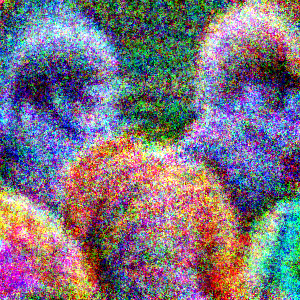</a><br><sub>CenterNet<br>Train</sub></td>
    <td align="center" width="120"><a href="assets/patches/tsea-mim/retinanet.png">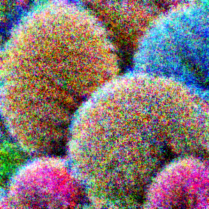</a><br><sub>RetinaNet<br>Train</sub></td>
    <td align="center" width="120"><a href="assets/patches/tsea-mim/mask_rcnn.png">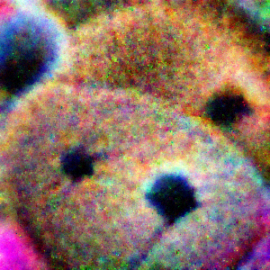</a><br><sub>Mask R-CNN<br>Test</sub></td>
    <td align="center" width="120"><a href="assets/patches/tsea-mim/faster_rcnn.png">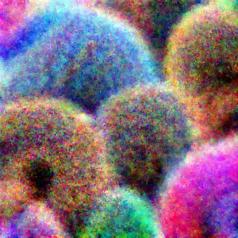</a><br><sub>Faster R-CNN<br>Train</sub></td>
    <td align="center" width="120"><a href="assets/patches/tsea-mim/ddetr.png">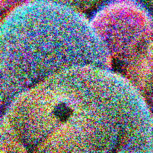</a><br><sub>D-DETR<br>Test</sub></td>
  </tr>
</table>

#### TCA

<table>
  <tr>
    <td align="center" width="120"><a href="assets/patches/TCA/yolov2.png">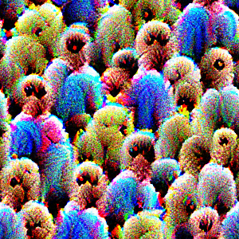</a><br><sub>YOLOv2<br>Train</sub></td>
    <td align="center" width="120"><a href="assets/patches/TCA/yolov3.png">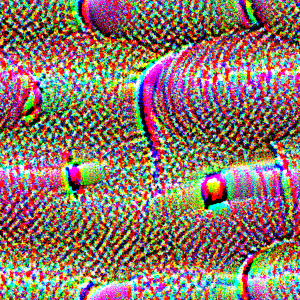</a><br><sub>YOLOv3<br>Train</sub></td>
    <td align="center" width="120"><a href="assets/patches/TCA/yolov4.png">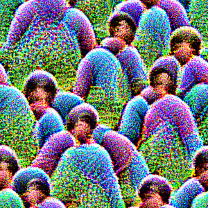</a><br><sub>YOLOv4<br>Test</sub></td>
    <td align="center" width="120"><a href="assets/patches/TCA/yolov5.png">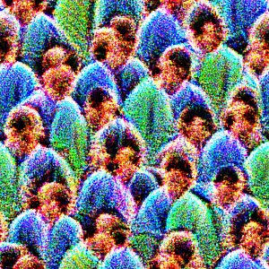</a><br><sub>YOLOv5<br>Train</sub></td>
    <td align="center" width="120"><a href="assets/patches/TCA/yolov7.png">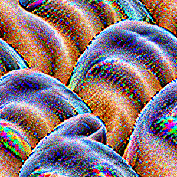</a><br><sub>YOLOv7<br>Train</sub></td>
    <td align="center" width="120"><a href="assets/patches/TCA/ssd.png">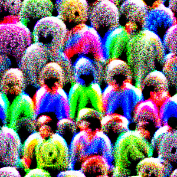</a><br><sub>SSD<br>Test</sub></td>
  </tr>
  <tr>
    <td align="center" width="120"><a href="assets/patches/TCA/centernet.png">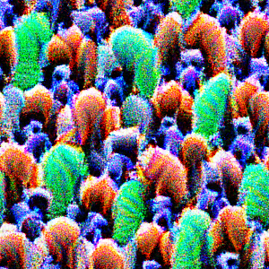</a><br><sub>CenterNet<br>Train</sub></td>
    <td align="center" width="120"><a href="assets/patches/TCA/retinanet.png"></a><br><sub>RetinaNet<br>Train</sub></td>
    <td align="center" width="120"><a href="assets/patches/TCA/mask_rcnn.png"></a><br><sub>Mask R-CNN<br>Train</sub></td>
    <td align="center" width="120"><a href="assets/patches/TCA/faster_rcnn.png"></a><br><sub>Faster R-CNN<br>Test</sub></td>
    <td align="center" width="120"><a href="assets/patches/TCA/ddetr.png"></a><br><sub>D-DETR<br>Test</sub></td>
  </tr>
</table>

#### T-SEA

<table>
  <tr>
    <td align="center" width="120"><a href="assets/patches/tsea/yolov2.png"></a><br><sub>YOLOv2<br>Test</sub></td>
    <td align="center" width="120"><a href="assets/patches/tsea/yolov3.png"></a><br><sub>YOLOv3<br>Train</sub></td>
    <td align="center" width="120"><a href="assets/patches/tsea/yolov4.png"></a><br><sub>YOLOv4<br>Train</sub></td>
    <td align="center" width="120"><a href="assets/patches/tsea/yolov5.png"></a><br><sub>YOLOv5<br>Test</sub></td>
    <td align="center" width="120"><a href="assets/patches/tsea/yolov7.png"></a><br><sub>YOLOv7<br>Train</sub></td>
    <td align="center" width="120"><a href="assets/patches/tsea/ssd.png"></a><br><sub>SSD<br>Train</sub></td>
  </tr>
  <tr>
    <td align="center" width="120"><a href="assets/patches/tsea/centernet.png"></a><br><sub>CenterNet<br>Test</sub></td>
    <td align="center" width="120"><a href="assets/patches/tsea/retinanet.png"></a><br><sub>RetinaNet<br>Test</sub></td>
    <td align="center" width="120"><a href="assets/patches/tsea/mask_rcnn.png"></a><br><sub>Mask R-CNN<br>Train</sub></td>
    <td align="center" width="120"><a href="assets/patches/tsea/faster_rcnn.png"></a><br><sub>Faster R-CNN<br>Train</sub></td>
    <td align="center" width="120"><a href="assets/patches/tsea/ddetr.png"></a><br><sub>D-DETR<br>Train</sub></td>
  </tr>
</table>

#### GNAP

<table>
  <tr>
    <td align="center" width="120"><a href="assets/patches/GNAP/yolov2.png"></a><br><sub>YOLOv2<br>Train</sub></td>
    <td align="center" width="120"><a href="assets/patches/GNAP/yolov3.png"></a><br><sub>YOLOv3<br>Train</sub></td>
    <td align="center" width="120"><a href="assets/patches/GNAP/yolov4.png"></a><br><sub>YOLOv4<br>Train</sub></td>
    <td align="center" width="120"><a href="assets/patches/GNAP/yolov5.png"></a><br><sub>YOLOv5<br>Train</sub></td>
    <td align="center" width="120"><a href="assets/patches/GNAP/yolov7.png"></a><br><sub>YOLOv7<br>Test</sub></td>
    <td align="center" width="120"><a href="assets/patches/GNAP/ssd.png"></a><br><sub>SSD<br>Test</sub></td>
  </tr>
  <tr>
    <td align="center" width="120"><a href="assets/patches/GNAP/centernet.png"></a><br><sub>CenterNet<br>Train</sub></td>
    <td align="center" width="120"><a href="assets/patches/GNAP/retinanet.png"></a><br><sub>RetinaNet<br>Train</sub></td>
    <td align="center" width="120"><a href="assets/patches/GNAP/mask_rcnn.png"></a><br><sub>Mask R-CNN<br>Train</sub></td>
    <td align="center" width="120"><a href="assets/patches/GNAP/faster_rcnn.png"></a><br><sub>Faster R-CNN<br>Test</sub></td>
    <td align="center" width="120"><a href="assets/patches/GNAP/ddetr.png"></a><br><sub>D-DETR<br>Test</sub></td>
  </tr>
</table>

#### DM-NAP

<table>
  <tr>
    <td align="center" width="120"><a href="assets/patches/DM-NAP/yolov2.png"></a><br><sub>YOLOv2<br>Train</sub></td>
    <td align="center" width="120"><a href="assets/patches/DM-NAP/yolov3.png"></a><br><sub>YOLOv3<br>Train</sub></td>
    <td align="center" width="120"><a href="assets/patches/DM-NAP/yolov4.png"></a><br><sub>YOLOv4<br>Test</sub></td>
    <td align="center" width="120"><a href="assets/patches/DM-NAP/yolov5.png"></a><br><sub>YOLOv5<br>Test</sub></td>
    <td align="center" width="120"><a href="assets/patches/DM-NAP/yolov7.png"></a><br><sub>YOLOv7<br>Train</sub></td>
    <td align="center" width="120"><a href="assets/patches/DM-NAP/ssd.png"></a><br><sub>SSD<br>Test</sub></td>
  </tr>
  <tr>
    <td align="center" width="120"><a href="assets/patches/DM-NAP/centernet.png"></a><br><sub>CenterNet<br>Test</sub></td>
    <td align="center" width="120"><a href="assets/patches/DM-NAP/retinanet.png"></a><br><sub>RetinaNet<br>Train</sub></td>
    <td align="center" width="120"><a href="assets/patches/DM-NAP/mask_rcnn.png"></a><br><sub>Mask R-CNN<br>Train</sub></td>
    <td align="center" width="120"><a href="assets/patches/DM-NAP/faster_rcnn.png"></a><br><sub>Faster R-CNN<br>Train</sub></td>
    <td align="center" width="120"><a href="assets/patches/DM-NAP/ddetr.png"></a><br><sub>D-DETR<br>Train</sub></td>
  </tr>
</table>

#### Six test-only patches

<table>
  <tr>
    <td align="center" width="120"><a href="assets/patches/AdvCloak/yolov2.png"></a><br><sub>AdvCloak / YOLOv2<br>Test</sub></td>
    <td align="center" width="120"><a href="assets/patches/AdvCloak/yolov3.png"></a><br><sub>AdvCloak / YOLOv3<br>Test</sub></td>
    <td align="center" width="120"><a href="assets/patches/AdvTshirt/yolov2.png"></a><br><sub>AdvTshirt / YOLOv2<br>Test</sub></td>
    <td align="center" width="120"><a href="assets/patches/AA/yolov2.png"></a><br><sub>AA / YOLOv2<br>Test</sub></td>
    <td align="center" width="120"><a href="assets/patches/AdvSticker/yolov3.png"></a><br><sub>AdvSticker / YOLOv3<br>Test</sub></td>
    <td align="center" width="120"><a href="assets/patches/UPC/yolov3.png"></a><br><sub>UPC / YOLOv3<br>Test</sub></td>
  </tr>
</table>

<!-- /APDE patch gallery -->

### Read the local dataset

```bash
python -m pip install Pillow
```

```python
from apde_data import APDEDataset

data = APDEDataset("APDE", split="test")
sample = data[0]
image, mask = sample["image"], sample["mask"]  # RGB / L PIL images
person_boxes, patch_boxes = sample["person_boxes"], sample["patch_boxes"]
```

The reader works with PyTorch `DataLoader`; supply a transform and a custom collate function for variable-length boxes. For downloaded HF files, follow the [download and usage examples](#download-and-use-apde-from-hugging-face).

### Provenance and limits

Four missing GNAP combinations were retrained with corrected settings. AdvCloak/YOLOv3 was recovered from its original paper's embedded patch figure. AA, AdvSticker, and UPC are newly trained detector adaptations; UPC is weak under the small-patch placement used here. These are not recovered original-author checkpoints. Detailed provenance and diagnostic results are in the [dataset card](docs/HF_DATASET_CARD.md).

The defense scores below belong to the published paper and have not been rerun on this reconstruction.

## 🧠 Retrained Defense

To verify the effectiveness of the APDE Dataset, we performed retraining on three mainstream defense methods (SAC, Adyolo, NAPGuard) using this dataset.

The table below shows the detection performance (mAP) before and after retraining under various adversarial patch attacks. It is worth noting that the AdvCloak and AdvTshirt attacks in the last two rows were NOT included in our retraining set (Out-of-Domain / Unseen). Experimental results show that retraining with APDE not only improves defense against known attacks but also significantly enhances generalization capabilities against unknown (out-of-domain) patches.

| Attack Method | SAC <br> *(Original / Retrained)* | Adyolo <br> *(Original / Retrained)* | NAPGuard <br> *(Original / Retrained)* |
| :--- | :---: | :---: | :---: |
| **T-SEA** | 51.82 / **71.61** | 66.61 / **72.47** | 83.61 / **86.31** |
| **TC-EGA** | 58.16 / **71.36** | 63.49 / **70.91** | 68.51 / **85.30** |
| **Advpatch** | 56.53 / **73.29** | 65.54 / **72.07** | 78.45 / **85.10** |
| **GNAP** | 70.03 / **76.86** | 72.94 / **78.52** | 78.96 / **85.42** |
| **DM-NAP** | 68.50 / **76.48** | 69.26 / **76.83** | 71.37 / **85.71** |
| **_Out-of-Domain (Unseen)_** | | | |
| **AdvCloak** | 4.17 / **71.29** | 18.29 / **22.36** | 52.21 / **73.16** |
| **AdvTshirt** | 34.27 / **64.47** | 8.19 / **37.53** | 50.21 / **70.89** |

**Weights Download:**
> **[Google Drive](https://drive.google.com/drive/folders/13y1xrvXo-p1JI7yGucAFHSy_wuqO_sFT?us)**
> *Google Drive Includes weights for SAC-Retrained, Adyolo-Retrained, NAPGuard-Retrained, etc.*

This repository integrates the following three typical defense methods and provides the corresponding retrained weights:

* **SAC (Segment and Complete)**: Locates adversarial patches via a segmentation network, removes them, and uses image inpainting technology to restore the background, thereby recovering detector performance.

* **Adyolo (Adversarial YOLO)**: Introduces a new "adversarial patch" class during the training phase, enabling the detector to actively identify and ignore adversarial patches in the scene, preventing them from interfering with normal object detection.

* **NAPGuard**: Specifically designed for naturalistic adversarial patches, it distinguishes generated adversarial textures from natural objects by analyzing texture and pixel distribution features.
